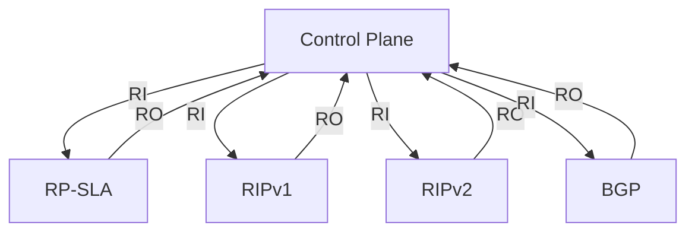
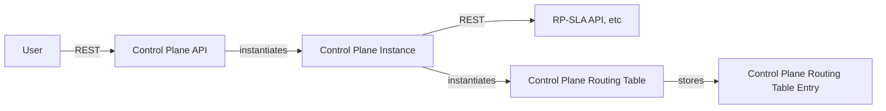
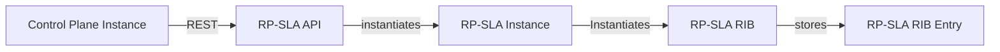
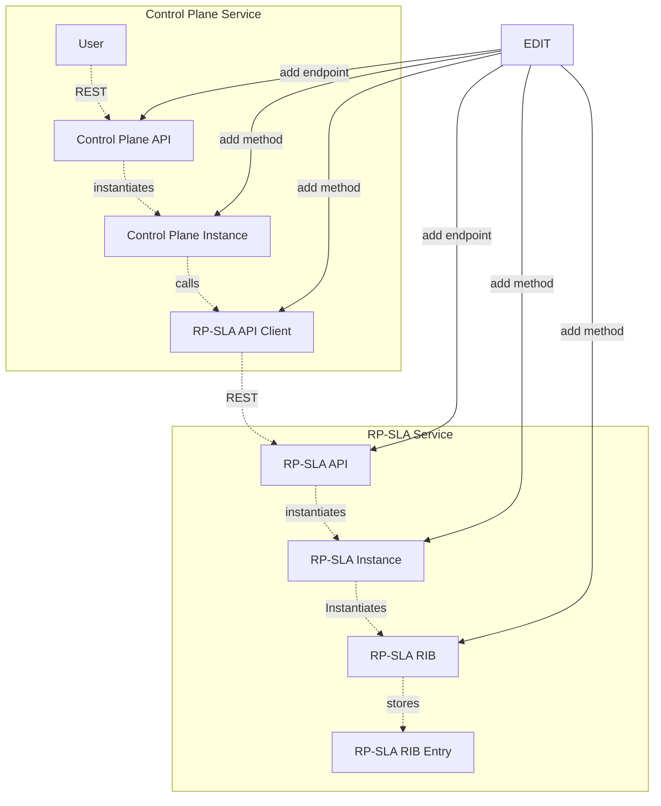

# Architecture

## Description
So far, PyRP is built around independent services. Currently, communication between services is via FastAPI REST APIs.  This will
likely change to a message bus in the future.  The intent is that the Control Plane itself is one service, while each
protocol implementation will be a separate service.  The Control Plane service will be responsible for ingestion of config
and coordinating the exchange of routes between the various protocol services.

## Redistribution
Redistribution working like so, configured on a per-protocol basis:  

*RI: Redistribute-In*  
*RO: Redistribute-Out*

That is the flow between processes.  Within these processes, typically we have several core components:
* A central "instance" class that manages the state for this instance.  It creates and manages all required RIBs,
    and is responsible for coordinating the exchange of routes between them and the outside world, etc.
* One or more RIBs, which are responsible for storing routes of various types.  Each RIB stores route entries of a specific
    type, with the protocol instance being responsible for any needed translation
  * RIB entries, which are the actual routes.  These are stored in the RIBs.
* An API interface responsible for exposing the instance to the outside world.  Currently, these are all FastAPI apps, .
    but this will likely change to a message bus in the future.
  * All interaction and configuration is through this interface

### graph of service components
*Control Plane Service*

Services for RP-SLA, RIPv1, etc follow a similar model

## Instances
All services are currently built around the assumption of multiple instances for a given service.  There might be real 
need for this in the future, but currently it's simply a clean way to manage state especially in testing where a given component
might be edited and restarted at any point.  The assumption is that after any work you tell the CP to build a new instance from config,
which triggers the rest. Old, existing state remains, but doesn't get in the way.

## Config handling

Notably config is not passed from the control plane to other services directly.  Instead, each instance (including the control plane itself)
ingests its own config from a given file.  The format of the config file is TOML.  When the CP is instantiating other services, it passes
the path to the config file to the service, which then ingests its own config from that file.  Currently we keep all config in a single TOML file, but 
there's no reason we couldn't split it up into multiple files in the future.

The exception to this is the config in `config.toml` in the project root.  This is the config that specifies which ports each service should
listen on, and is currently statically configured.  Any change to these would need to also be reflected in eventual docker config, etc. 

## Protocol Service Details
as an example, take the RP-SLA protocol:  
 *RP-SLA Service*

The API is primarily meant to be used by the control plane, but could be used by users directly, especially for testing.
Low level operations like "importing a single route" can be exposed, but they should be used only for testing.
Instead, higher level operations like "redistribute-in" should be used, which would apply all the necessary business logic 
of the protocol itself (e.g. any necessary translations, filtering, etc).

Similarly, RIBs themselves typically have simple fundamental operations like add/remove import/export, etc.  But the protocol instance 
itself should use higher level operations like "redistribute-in", "redistribute-out", etc to apply the necessary business logic.

## Adding a new operation
When adding a new operation, (e.g. "show routes in the rp-sla rib"), these are the general steps:

